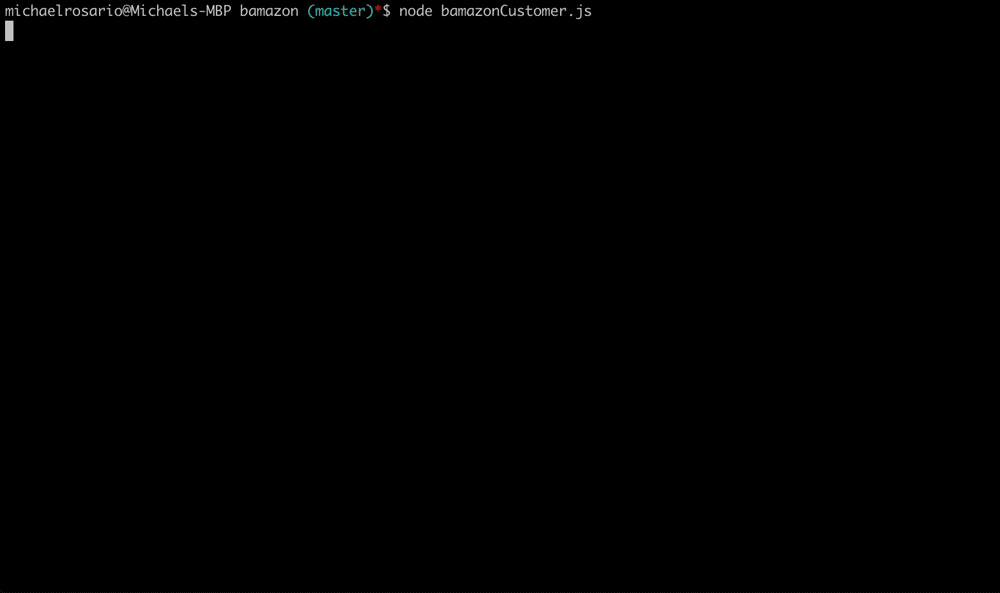
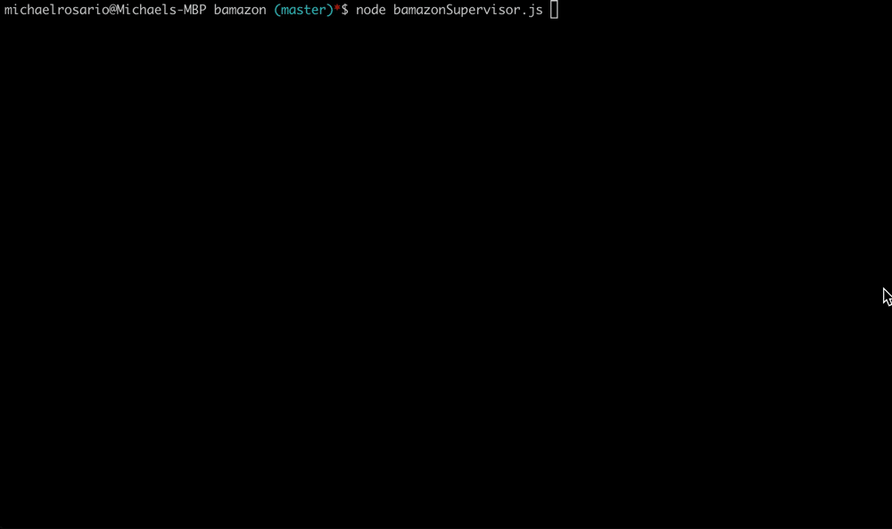

# Bamazon 
A NODE CLI Application using Inquirer and MySQL packages. Three parts - (1) Customer View, (2) Manager View and (3) Supervisor View

## Customers 
Customers are able to make purchases by entering an ID of a product in a list.  By entering a valid ID, they are prompted for the quantity for purchase. 
They can required to enter a quantity from 1 to the amount in stock.  A successful purchase updates the MySQL database and updates the inventory amount. 

## Manager 
Managers can (1) View Products for Sale, (2) View Low Inventory, (3) Add to Inventory, and (4) Add New Product.

### View Products for Sale 
This option allows managers to see all the items in the Product database.

### View Low Inventory 
This option displays all products that have less than 5 items in stock.

### Add to Inventory 
This option allows the manager the ability to select a product by ID and update the quantity in stock.

### Add New Product 
This option allows the manager the ability to add a new product.  They will be prompted to enter a product name, select a department, enter a price, and a quantity in stock.

## Supervisor 
Supervisors are able to (1) View Product Sales by Department and (2) Create New Departments.

### View Product Sales by Department
This option will display the total revenues and profit margins per department.  We are using a MYSQL query that joins the Product and Departments table to create a summary listing.

### Create New Department
This option allows the supervisor to create a unique Department.  Adding a new category will allow managers to create products under this new category.

